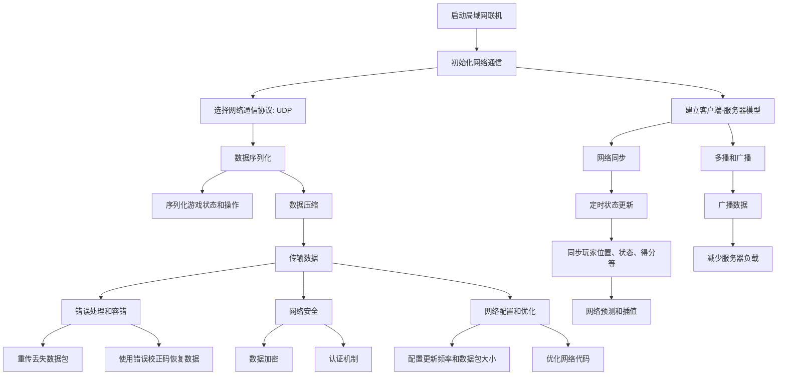

```mermaid
flowchart TD;
    A1[启动局域网联机] --> A2[初始化网络通信]
    A2 --> B1[选择网络通信协议: UDP]
    A2 --> B2[建立客户端-服务器模型]

    B1 --> C1[数据序列化]
    B2 --> C2[网络同步]
    B2 --> C3[多播和广播]

    C1 --> D1[序列化游戏状态和操作]
    C1 --> D2[数据压缩]
    D2 --> E1[传输数据]

    C2 --> D3[定时状态更新]
    D3 --> E2[同步玩家位置、状态、得分等]
    E2 --> F1[网络预测和插值]

    C3 --> D4[广播数据]
    D4 --> E3[减少服务器负载]

    E1 --> G1[错误处理和容错]
    G1 --> H1[重传丢失数据包]
    G1 --> H2[使用错误校正码恢复数据]

    E1 --> G2[网络安全]
    G2 --> H3[数据加密]
    G2 --> H4[认证机制]

    E1 --> G3[网络配置和优化]
    G3 --> H5[配置更新频率和数据包大小]
    G3 --> H6[优化网络代码]
```