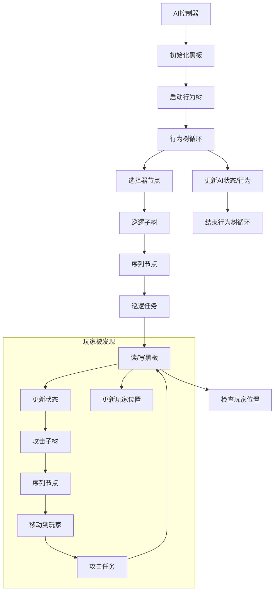

```mermaid
graph TD;
    AIController[AI控制器] --> InitializeBlackboard[初始化黑板]
    InitializeBlackboard --> StartBehaviorTree[启动行为树]
    StartBehaviorTree --> BehaviorTreeLoop[行为树循环]
    BehaviorTreeLoop --> SelectorNode[选择器节点]
    SelectorNode --> PatrolSubtree[巡逻子树]
    PatrolSubtree --> SequenceNode1[序列节点]
    SequenceNode1 --> PatrolTask[巡逻任务]
    PatrolTask --> ReadWriteBlackboard[读/写黑板] --> 检查玩家位置
    ReadWriteBlackboard --> UpdateStatus[更新状态]
    
    subgraph PlayerDetected[玩家被发现]
        UpdateStatus --> AttackSubtree[攻击子树]
        AttackSubtree --> SequenceNode2[序列节点]
        SequenceNode2 --> MoveToPlayer[移动到玩家]
        MoveToPlayer --> AttackTask[攻击任务]
        AttackTask --> ReadWriteBlackboard[读/写黑板] --> 更新玩家位置
    end

    BehaviorTreeLoop --> UpdateAIStateBehavior[更新AI状态/行为]
    UpdateAIStateBehavior --> EndBehaviorTreeLoop[结束行为树循环]
```